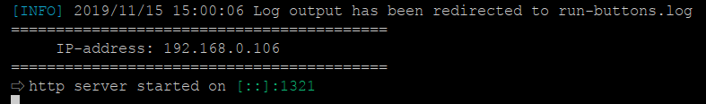

# Run Buttons

Программа Run Buttons позволяет вам запускать приложения на компьютере с мобильного телефона. Программа состоит из двух частей - приложения, которое необходимо запустить на компьютере и приложения для Android, которое необходимо установить на телефон. Для соединения компьютера и телефона нужно, чтобы телефон подключился по Wi-Fi к той же сети, к которой подключен компьютер.
Данный репозитарий содержит исходный код и готовые приложения для запуска на компьютере. Исходный код и приложение для мобильного телефона находится в репозитарии [github.com/gentee/run_buttons_phone](https://github.com/gentee/run_buttons_phone).

## Скачать

Вы можете самостоятельно скомпилировать десктоп приложение или скачать готовые исполняемые файлы для вашей платформы.

- [Linux amd64](https://github.com/gentee/run-buttons/releases/download/v1.0.0/run-buttons-1.0.0-linux-amd64.zip)
- [Windows amd64](https://github.com/gentee/run-buttons/releases/download/v1.0.0/run-buttons-1.0.0-windows-amd64.zip)
- [macOS amd64](https://github.com/gentee/run-buttons/releases/download/v1.0.0/run-buttons-1.0.0-darwin-amd64.zip)

Прочие дистрибутивы для Linux, macOS, Windows находятся [здесь](https://github.com/gentee/run-buttons/releases).

## Ссылки

- [Run Buttons клиент для Android](https://github.com/gentee/run_buttons_phone)
- [Documentation](README.md)

## Шаг 1. Создайте файл конфигурации

Перед запуском программы вам необходимо создать файл конфигурации **run-buttons.yaml**. Он должен находится в той же директории, что и программа. Вы можете переименовать этот файл и хранить его где угодно, но в этом случае, вы должны указывать полное его имя в параметре при запуске.

```
# default config file
./run-buttons
# custom config file
./run-buttons /home/user/mybuttons.cfg
```

## Шаг 2. Настройка файла конфигурации

Файл конфигурации должен иметь формат YAML. Рассмотрим все параметры, которые можно указать в файле конфигурации.  

**password**  
Пароль, не является обязательным, но крайне рекомендуется его указывать.  

**port**  
По умолчанию, используется порт *1321*. Вы можете указать другой порт, но в этом случае этот же порт необходимо будет указывать вместе с IP-адресом при подключении с мобильного телефона.

**logfile**  
По умолчанию, вся информация о подключениях и запусках выводится на консоль. Вы можете указать лог-файл, для записи этой информации на диск. 

**defcolor**  
Можно указывать цвет иконки для каждой кнопки. Если он не определен, то будет использоваться данный RGB цвет. По умолчанию, *0x006699*.

**deficon**  
Можно указывать иконку для каждой кнопки. Если иконка не определена, то будет использоваться указанная иконка. По умолчанию, *play_circle_outline*.  Необходимо указывать имя из [Material Design Icons](https://material.io/resources/icons/?style=baseline). 

**devices**  
Для безопасности, рекомендуем указать в этом параметре список уникальных идентификаторов мобильных устройств, которые могут подключаться к компьютеру.  В этом случае, подключение с других устройств будет невозможно, даже зная пароль. Уникальный идентификатор устройства показывается на странице логина в мобильном приложении.

**btns**  
Этот параметр содержит список кнопок для запуска приложений. Это единственный обязательный параметр.  Каждая кнопка может иметь следующие параметры:

  * *cmd* - запускаемое приложение. Обязательный параметр.
  * *params* - массив параметров командной строки
  * *dir* - рабочая директория
  * *title* - заголовок кнопки. Если не указан, то на кнопке будет показываться имя запускаемого приложения.
  * *desc* - дополнительное описание, которое показывается под заголовком кнопки.
  * *color* - RGB цвет иконки.
  * *icon* - имя Material Design иконки.

Пример конфигурации
``` yaml
password: 1234
logfile: run-buttons.log
devices: [a3a454fa41a4fc0a]

btns:
  - cmd: gnome-calculator
    title: Calculator
    icon: view_module
  - cmd: gucharmap
    title: Character Map
  - cmd: gnome-terminal
    title: New Terminal
    icon: desktop-windows
    desc: Open a new terminal
  - cmd: xdg-open
    params: [https://ru.wikipedia.org/]
    title: Wikipedia
    icon: language
    color: 0x33ccff
  - cmd: xdg-open
    params: 
      - https://github.com/gentee/run_buttons_phone
    title: Run Buttons
    desc: Site of the mobile client
    icon: play_circle_filled
    color: 0x669900
```

Шаг 3. Запуск

После того как вы создали файл конфигурации с кнопками для запуска приложений, вы можете запустить программу **Run Buttons**. Если все настройки были указаны верно, то она выведет примерно следующее. 



Здесь вы видите IP-адрес, который необходимо будет указать в мобильном приложении. Если вы будете вносить изменения в файл конфигурации, то вы должны перезапускать программу. В мобильном приложении достаточно нажать на кнопку обновления.