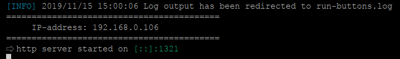

# Run Buttons

Run Buttons allows you to run applications on your computer from your mobile phone. The program consists of two parts - the application to be run on your computer and the Android application to be installed on your phone. To connect the computer and the phone, the phone needs to connect via Wi-Fi to the same network  which the computer is connected to.
This repository contains the source code and compiled programs to run on the computer. The source code and the mobile phone application can be found at **[github.com/gentee/run_buttons_phone](https://github.com/gentee/run_buttons_phone)**.

## Download

Run Buttons is a **cross-platform, free and open source** application. You can compile the desktop application yourself or download ready binary files for your platform.

- [Linux amd64](https://github.com/gentee/run-buttons/releases/download/v1.0.0/run-buttons-1.0.0-linux-amd64.zip)
- [Windows amd64](https://github.com/gentee/run-buttons/releases/download/v1.0.0/run-buttons-1.0.0-windows-amd64.zip)
- [macOS amd64](https://github.com/gentee/run-buttons/releases/download/v1.0.0/run-buttons-1.0.0-darwin-amd64.zip)

You can download other binary distributions for Linux, macOS, Windows [here](https://github.com/gentee/run-buttons/releases).

## Mobile client

[](https://play.google.com/store/apps/details?id=net.gentee.run_buttons_phone&pcampaignid=pcampaignidMKT-Other-global-all-co-prtnr-py-PartBadge-Mar2515-1)

- **[Run Buttons client for Android](https://github.com/gentee/run_buttons_phone)**

## Links

- [Документация на русском](README-ru.md)

### Youtube
[](https://www.youtube.com/watch?v=ipd8pMGdaSs)


## Step 1: Create a configuration file

Before you start the program, you need to create a configuration file **run-buttons.yaml**. It must be in the same directory as the program. You can rename this file and store it anywhere, but in this case, you must specify its full name in the parameter at startup.

```
# default config file
./run-buttons
# custom config file
./run-buttons /home/user/mybuttons.cfg
```

## Step 2: Parameters of the configuration file

The configuration file must be in YAML format. Let's consider all the parameters that can be specified in the configuration file.  

**password**  
Password is not mandatory, but it is highly recommended to enter it.  

**port**  
The default port is *1321*. You can specify a different port, but in this case the same port must be specified together with the IP address when connecting from a mobile phone.

**logfile**  
By default, all information about connections and launches is displayed on the console. You can specify a log file to write this information to the disk. 

**defcolor**  
You can specify the icon color for the each button. If it is not defined, this RGB color will be used. By default, *0x0066699*.

**deficon**  
You can specify an icon for each button. If the icon is not defined, the specified icon will be used. By default, *play_circle_outline*.  You must use names from [Material Design Icons](https://material.io/resources/icons/?style=baseline). 

**devices**  
For security reasons, we recommend that you specify a list of unique mobile device IDs that can be connected to your computer in this parameter.  In this case, connection from other devices will not be possible even if someone knows the password. The unique device ID is shown on the login page of the mobile application.

**btns**  
This option contains a list of buttons to start applications. This is the required parameter. Each button can have the following parameters:

  * *cmd* - the application to be launched. Required parameter.
  * *params* - an array of command line parameters.
  * *dir* - working directory.
  * *title* - the title of the button. If it is not specified, the name of the application will be shown on the button.
  * *desc* - additional description, which is shown under the button title.
  * *color* - custom RGB icon color.
  * *icon* - custom name of Material Design icon.

Example of the configuration

``` yaml
password: 1234
logfile: run-buttons.log
devices: [a3a454fa41a4fc0a]

btns:
  - cmd: gnome-calculator
    title: Calculator
    icon: view_module
  - cmd: gucharmap
    title: Character Map
  - cmd: gnome-terminal
    title: New Terminal
    icon: desktop-windows
    desc: Open a new terminal
  - cmd: xdg-open
    params: [https://ru.wikipedia.org/]
    title: Wikipedia
    icon: language
    color: 0x33ccff
  - cmd: xdg-open
    params: 
      - https://github.com/gentee/run_buttons_phone
    title: Run Buttons
    desc: Site of the mobile client
    icon: play_circle_filled
    color: 0x669900
```

## Step 3. Launch.

Once you have created a configuration file with buttons to run the application, you can start the **Run Buttons** program. If all the settings have been set correctly, it will display approximately the following. 



Here you can see the IP address that you will need to specify in your mobile application. If you make changes to the configuration file, you must restart the program. In the mobile application, just press the update button.
